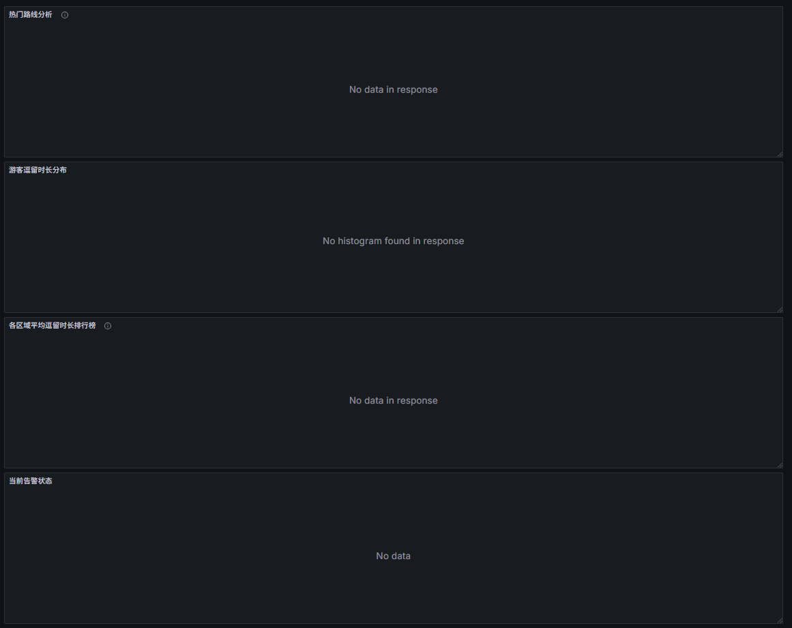

## 准备工作
MySQL数据库表已经实现创建完成
打开服务，并且进入flinksql
```
ludy@LAPTOP-FAOM7SQ7:~/flink/flink118$ jps
1553 StandaloneSessionClusterEntrypoint
2018 Jps
1875 TaskManagerRunner
614 QuorumPeerMain
```

代码都能跑起来了，
但是时区没解决
另外遇到一个这个问题

几个表里面都没有数据