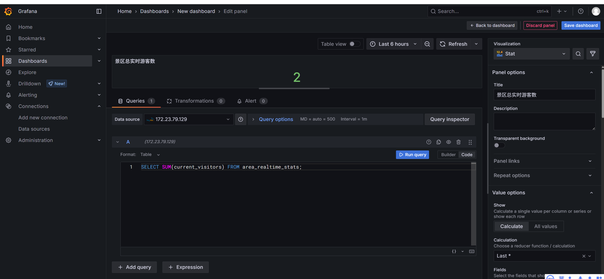
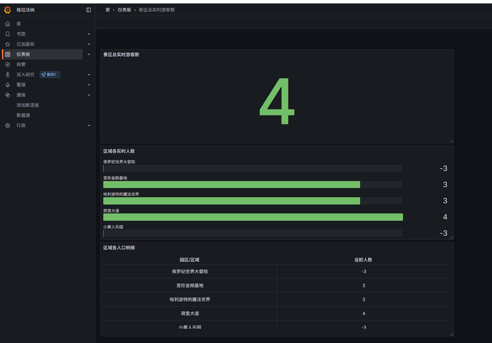
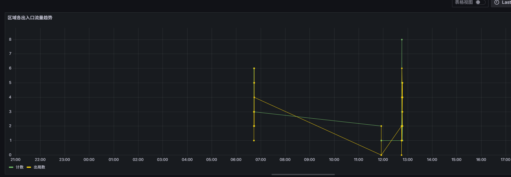

# 项目名称
VisitorGuard-ScenicSystem 

# 项目简介
VisitorGuard-ScenicSystem 是一个面向智慧景区的实时游客流量监测与智能预警平台。传统景区管理方式往往存在信息延迟、响应滞后等问题，难以应对节假日等高峰期突发的客流压力。本项目利用现代化的实时数据处理技术栈，通过模拟生成游客入园出园数据，利用 Kafka 进行高吞吐量的数据采集与缓冲，交由 Apache Flink 进行实时的流式计算与分析，最终将处理结果存入 MySQL 数据库，并为后续的可视化大屏和管理决策提供毫秒级的实时数据支撑。
该系统旨在解决景区管理者对内部游客分布、流量动态、区域承载力等关键指标无法实时掌控的痛点，从而实现精细化管理、提升游客体验、有效预防拥堵和踩踏等安全事故。

# 核心功能分析
我们可以将系统的核心功能拆解为以下几个模块：
1. 实时游客流量监控：
* 全域总览： 实时计算并展示整个景区的当前总游客人数。
* 分区统计： 实时计算并展示景区内各个核心景点或区域（如A门、B展馆、C山顶）的当前游客人数。
* 出入流量统计： 按时间窗口（如每分钟）统计整个景区及各分区的进入人次和离开人次。
2. 游客饱和度预警：
* 阈值设定： 系统可以为整个景区及每个分区设定不同的游客容量阈值（如：舒适、拥挤、警戒）。
* 实时预警： 当某个区域的实时游客数超过预设的阈值时，系统立即生成一条预警信息。例如，“C山顶当前人数已达8500，超过警戒阈值8000，请启动限流措施！”。
* 预警升级： 可以设计多级预警机制，例如，超过“拥挤”阈值时为黄色预警，超过“警戒”阈值时为红色预警。
3. 游客行为分析：
* 平均逗留时长： 分析游客在整个景区或特定景点的平均游玩时间。
* 热门路线分析： 通过分析游客在不同景点的出入顺序，发现最受欢迎的游览路线。
4. 数据持久化与服务：
* 结果存储： 将 Flink 计算出的实时指标（如各区域当前人数、预警信息）稳定地存储到 MySQL 数据库中。
* 数据接口： （未来展望）MySQL 中的数据可以作为数据源，通过 API 提供给前端的可视化大屏、移动管理App等应用使用。

# 创新点与亮点
1. 技术栈先进性与整合度： 巧妙地整合了 Golang + Kafka + Flink + MySQL 这一套在业界被广泛验证的高性能实时数据处理方案。
* Golang Producer： 使用并发性能优异的 Go 语言来模拟高并发的设备数据上报场景，代码简洁高效。
* Kafka 消息队列： 作为数据总线，实现了数据源与数据处理的解耦，提供了强大的数据缓冲能力和可扩展性。
* Flink 流处理引擎： 这是项目的技术核心。利用 Flink 强大的状态计算和窗口计算能力，在保证低延迟（毫秒级）的同时，能够进行复杂的事件时间处理，确保数据统计的准确性。
* Flink SQL 声明式开发： 我们主要使用 Flink SQL 进行开发，这极大地降低了流处理程序的开发门槛，让我们可以像写普通 SQL 一样来定义复杂的实时分析逻辑，开发效率高，逻辑清晰。
2. 端到端的实时性： 整个数据链路从采集、传输、处理到预警，均为实时流式处理，确保管理者看到的数据是“当下”的真实情况，从而可以做出最及时的反应。
3. 高度的可扩展性： 系统的每一个组件（Kafka、Flink）都是分布式的，未来当景区规模扩大、数据量激增时，只需横向扩展节点即可平滑地提升整个系统的处理能力。

# 项目架构
我们的整体数据流现在看起来会是这样：

**数据模拟 -> 数据采集 -> 实时计算 -> 结果存储 -> 可视化展示**
**[ Golang Producer ] -> [ Kafka ] -> [ Flink SQL ] -> [ MySQL ] -> [ Grafana ]**

1. Golang Producer: 模拟游客进出事件，将数据作为 JSON 字符串发送到 Kafka 的 visitor_events 主题中。
2. Kafka: 接收并缓存这些实时事件数据。
3. Flink SQL:
* 从 Kafka 的 visitor_events 主题中消费数据。
* 实时计算每个区域的当前游客数。
* 根据预设阈值判断是否需要预警。
* 将计算出的实时指标（如各区域当前人数）和预警信息写入到不同的 MySQL 表中。
4. MySQL:
* 作为 Flink 计算结果的持久化存储。
* 我们会创建至少两张表：一张用于存储各区域的实时游客数量（会持续被 Flink 更新），另一张用于记录生成的预警日志。
5. Grafana:
* 连接数据源： 将 MySQL 配置为 Grafana 的数据源。
* 创建仪表盘 (Dashboard): 通过编写简单的 SQL 查询（在 Grafana 面板中），从 MySQL 拉取数据并以非常直观的图表进行展示。

# 我们将在 Grafana 中实现什么？
在 Grafana 仪表盘上，我们可以创建以下酷炫的可视化组件：
* 总览计数器 (Stat Panel): 一个醒目的数字，显示当前整个景区的总游客数。
* 区域仪表盘 (Gauge): 为每个核心景点（A门、B展馆等）创建一个仪表盘，直观显示当前人数与最大容量的百分比，并根据百分比改变颜色（如：绿色代表舒适，黄色代表拥挤，红色代表警戒）。
* 流量趋势图 (Time Series Graph): 用折线图展示在过去一段时间内（如最近1小时），各个区域游客数量的变化趋势。
* 预警列表 (Table / Alert List): 一个实时滚动的列表，展示所有由 Flink 生成的预警信息，包括预警时间、区域和具体内容。


我不确定我配置的对不对：


配置好的仪表盘：



我目前遇到了一个问题，
这是程序终端打印的输出
```
2025/07/15 20:47:27 成功发送消息: {"event_time":"2025-07-15T12:47:26.256","area_id":"变形金刚基地","action":"out","user_id":"user-6715"}
2025/07/15 20:47:29 成功发送消息: {"event_time":"2025-07-15T12:47:28.032","area_id":"好莱坞大道","action":"out","user_id":"user-9458"}
2025/07/15 20:47:31 成功发送消息: {"event_time":"2025-07-15T12:47:30.001","area_id":"哈利波特的魔法世界","action":"in","user_id":"user-8836"}
```
这是MySQL存的时间：
```
小黄人乐园	2025-07-14 22:43:00	5	1
小黄人乐园	2025-07-14 22:44:00	3	5
小黄人乐园	2025-07-15 03:55:00	2	0
小黄人乐园	2025-07-15 04:45:00	1	2
小黄人乐园	2025-07-15 04:46:00	8	1
小黄人乐园	2025-07-15 04:47:00	2	2
```
为什么有这么大的时差，目前没有解决。
看班只能读MySQL里面的有偏差的时间


ludy@LAPTOP-FAOM7SQ7:~/kafka/kafka_2.12-3.6.1$ date
Wed Jul 16 09:30:08 CST 2025


# 功能实现
## 游客饱和预警
1. 创建“规则库”： 在 MySQL 中创建一张表，用来存放每个区域的预警阈值。
2. 创建“警报日志”： 在 MySQL 中创建另一张表，用来记录所有触发的警报信息。
3. 编写“预警规则引擎”： 在 Flink SQL 中编写核心的预警逻辑，这是最关键的一步。

游客预警的面板没调好，，，不会调，我服了。

## 游客行为分析
### 计算游客在各个景点的平均逗留时长

要计算逗留时长，我们必须能够精确地识别出同一个游客，在同一个区域，完成了一次完整的“进入”和“离开”行为。

CREATE TABLE visitor_stay_duration (
    user_id VARCHAR(255),
    area_id VARCHAR(255),
    entry_time DATETIME(3),   -- 进入时间
    exit_time DATETIME(3),    -- 离开时间
    duration_minutes BIGINT    -- 逗留时长（分钟）
);

flinksql：
CREATE TABLE mysql_sink_stay_duration (
    `user_id` VARCHAR,
    `area_id` VARCHAR,
    `entry_time` TIMESTAMP(3),
    `exit_time` TIMESTAMP(3),
    `duration_minutes` BIGINT
) WITH (
    'connector' = 'jdbc',
    'url' = 'jdbc:mysql://172.23.79.129:3306/bigdata?serverTimezone=UTC',
    'table-name' = 'visitor_stay_duration',
    'username' = 'remote_user', -- 替换为你的用户名
    'password' = 'Admin@123'    -- 替换为你的密码
);


我们将创建两个新的面板：
面板一：各区域平均逗留时长（排行榜）
这个面板会清晰地展示出哪个景点的“粘性”最强，游客最愿意花时间。我们将使用一个条形图 (Bar chart) 来制作排行榜。
面板二：游客逗留时长分布（直方图）
这个面板可以帮助我们了解游客的普遍行为模式。比如，大多数游客的游玩时长是集中在 10-20 分钟，还是 30-60 分钟？这对于评估项目吸引力和优化游客体验非常重要。我们将使用一个直方图 (Histogram) 来实现。


## 热门路线分析
这个功能的实现，将真正体现出 Flink 复杂事件处理 (CEP) 的威力，让我们的系统能够从单个景点的分析，跃升到对游客流动路径的深层洞察。

**目标与价值**
我们的目标是识别出游客在景区中最常走的连续路径。例如，我们想知道：
从“好莱坞大道”离开后，去“侏罗纪世界大冒险”的游客多，还是去“小黄人乐园”的游客多？
是否存在一条经典的“三步走”路线，比如 A -> B -> C？
这些信息对于优化景区布局、设置引导标识、安排商业网点、疏导人流都具有极高的战略价值。
**技术挑战：识别跨区域的事件序列**
要实现这个功能，我们需要识别一个比“进入-离开”更复杂的模式：
“同一个游客，在 A 区域有一个‘离开(out)’事件，紧接着在 B 区域有一个‘进入(in)’事件，并且这两个事件之间的时间间隔不能太长（比如不能超过30分钟）。”
我们将再次使用 MATCH_RECOGNIZE，但这次的 PATTERN 会更复杂，涉及到连续两个不同事件的匹配。

USE bigdata; -- 或你的数据库名

CREATE TABLE visitor_route_log (
    user_id VARCHAR(255),
    from_area VARCHAR(255),  -- 起点区域
    to_area VARCHAR(255),    -- 终点区域
    route_time DATETIME(3),  -- 到达终点区域的时间
    travel_time_minutes BIGINT -- 在两个区域之间的移动耗时（分钟）
);

CREATE TABLE mysql_sink_route_log (
    `user_id` VARCHAR,
    `from_area` VARCHAR,
    `to_area` VARCHAR,
    `route_time` TIMESTAMP(3),
    `travel_time_minutes` BIGINT
) WITH (
    'connector' = 'jdbc',
    'url' = 'jdbc:mysql://172.23.79.129:3306/bigdata?serverTimezone=UTC',
    'table-name' = 'visitor_route_log',
    'username' = 'remote_user', -- 替换为你的用户名
    'password' = 'Admin@123'    -- 替换为你的密码
);